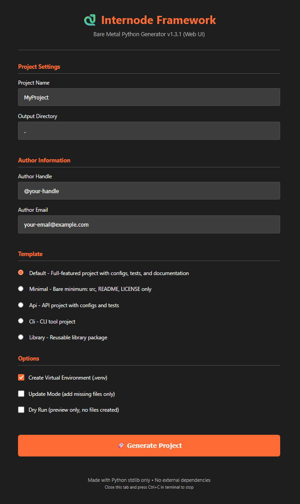

# Internode Bare Metal Framework

> **Single-file, zero-dependency Python project generator**

<!-- CI/CD Badges -->
[](https://github.com/pkeffect/python-framework/actions/workflows/ci.yml)
[](https://github.com/pkeffect/python-framework/releases)
[](https://www.python.org/downloads/)
[](https://opensource.org/licenses/MIT)
[]()
[](https://github.com/psf/black)
[](https://github.com/astral-sh/ruff)
[](https://github.com/PyCQA/bandit)

A production-ready Python project generator that creates complete project structures using **only the Python standard library**. No pip install, no virtual environments needed to run—just Python.



## ✨ Features

- 🐍 **Zero Dependencies** - Uses only Python stdlib
- 📄 **Single File** - One `.py` file, ~2000 lines
- 🎨 **Dual GUI** - Tkinter native + Web UI fallback
- 📦 **5 Templates** - default, minimal, api, cli, library
- 🔌 **Plugin System** - Extensible via `~/.internode/plugins/`
- ⚙️ **Config File** - User defaults in `~/.internode.toml`
- 🔄 **Update Mode** - Add missing files to existing projects

## 🚀 Quick Start

```bash
# Clone or download
git clone https://github.com/pkeffect/python-framework.git
cd python-framework

# Generate a project
python python_framework.py --name MyProject

# Or use the GUI
python python_framework.py --gui

# Or use the web-based GUI
python python_framework.py --gui2
```

## 📋 Usage

```bash
# Basic generation
python python_framework.py --name MyApp

# With options
python python_framework.py --name MyApp --template minimal --no-venv

# Interactive mode
python python_framework.py --interactive

# Preview without creating files
python python_framework.py --name TestProject --dry-run

# Update existing project
python python_framework.py --name ExistingProject --update

# GUI modes
python python_framework.py --gui   # Tkinter (with web fallback)
python python_framework.py --gui2  # Web UI directly
```

## 📁 Generated Structure

```
MyProject/
├── .github/workflows/ci.yml
├── .pre-commit-config.yaml
├── .gitignore
├── configs/
│   └── config.json, config.yaml, config.toml, config.ini
├── docs/
│   └── CODE_OF_CONDUCT.md, CONTRIBUTING.md, SUPPORT.md, ...
├── src/myproject/
│   └── __init__.py, main.py, utils.py
├── tests/
│   └── __init__.py, test_main.py
├── .venv/ (optional)
├── Dockerfile
├── LICENSE
├── manage.py
├── pyproject.toml
└── README.md
```

## 🎨 Templates

| Template | Description |
|----------|-------------|
| `default` | Full-featured with configs, tests, and documentation |
| `minimal` | Bare minimum: src, README, LICENSE only |
| `api` | API project with configs and tests |
| `cli` | CLI tool project |
| `library` | Reusable library package |

## ⚙️ Configuration

Create `~/.internode.toml` for user defaults:

```toml
author = "@pkeffect"
email = "your-email@example.com"
template = "default"
```

## 🔌 Plugins

Create plugins in `~/.internode/plugins/`:

```python
# ~/.internode/plugins/my_plugin.py
def register():
    return {"name": "My Plugin", "version": "1.0"}

def post_generate(generator):
    print(f"Generated: {generator.project_name}")
```

## 📄 License

MIT License - see [LICENSE](LICENSE)

## 👨‍💻 Author

**pkeffect** - [GitHub](https://github.com/pkeffect)
